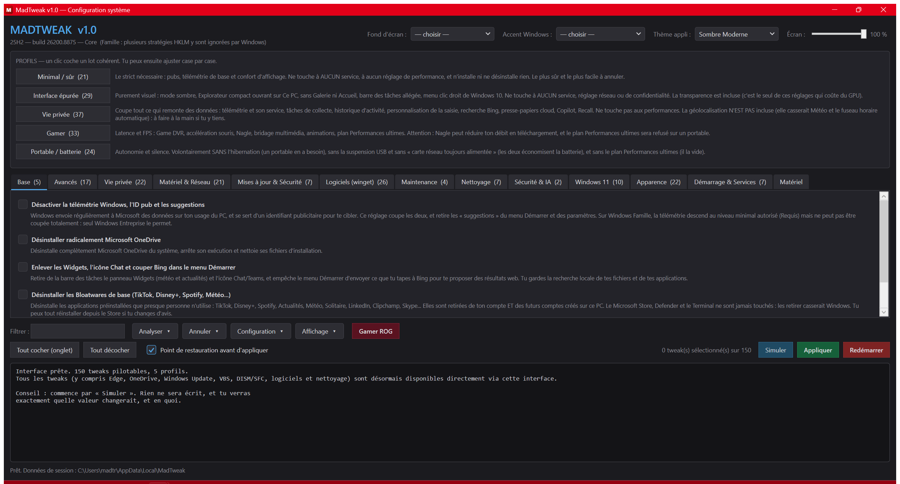

<div align="center" markdown="1">
  

  # 🔴 MadTweak v1.3.1

  **L'optimisation maîtrisée de votre Windows 10 / 11**

  *Utilitaire PowerShell d'optimisation, de confidentialité, d'apparence et de maintenance — en français, avec annulation réelle.*

  [](https://www.microsoft.com/windows)
  [](https://learn.microsoft.com/powershell/)
  [](https://github.com/LordMadTrix/madtweak/releases/latest)
  [](LICENSE)

  **Français** · [English](README.en.md)
</div>

<div align="center">
  
  <p><sub><i>L'interface : profils, 150 tweaks par onglets avec leur explication, et le journal en direct.</i></sub></p>
</div>

---

## ⚡ Fonctionnalités principales

### 🛡️ **Confidentialité & nettoyage**
- ✅ **150 tweaks** réversibles : télémétrie, pubs, Copilot, Recall, bloatwares
- ✅ **5 profils** prêts à l'emploi (Minimal, Interface épurée, Vie privée, Gamer, Portable)
- ✅ **Nettoyage mesuré** : chaque poste est pesé avant d'être purgé

### 🔍 **Analyser sa machine**
- ✅ **Score de santé /100** avec le détail par catégorie
- ✅ **Analyse du démarrage** : durée réelle et coût de chaque programme
- ✅ **Diagnostic des plantages** : croise les arrêts inattendus avec les tweaks actifs
- ✅ **Détection de dérive** : repère ce qu'une mise à jour Windows a réactivé

### ↩️ **Annulation réelle**
- ✅ **Sauvegarde avant écriture** : chaque valeur touchée est mémorisée
- ✅ **Restauration exacte**, totale ou tweak par tweak
- ✅ **Mode simulation** : tout voir sans rien écrire

### 💾 **Installer Windows sans y assister**
- ✅ **Fichier de réponses** généré pour ta clé USB : plus aucune question à l'installation
- ✅ **Compte, langue, fuseau, édition, applications** décidés à l'avance
- ✅ **Un profil MadTweak appliqué au premier démarrage**, machine propre d'emblée

### 🎨 **Interface & personnalisation**
- ✅ **Interface graphique** thémable (6 thèmes) ou 16 menus console
- ✅ **Accent Windows**, fonds d'écran « MadTrix » générés par code
- ✅ **Bonus ASUS ROG** : clavier RGB en HID direct, capteurs GPU et ventilateurs

---

## 🚀 Installation

Télécharge **[`MadTweak.ps1`](https://github.com/LordMadTrix/madtweak/releases/latest)** (un seul fichier, autonome) puis, dans un terminal **administrateur** :

```powershell
powershell.exe -NoProfile -ExecutionPolicy Bypass -File .\MadTweak.ps1
```

> Windows peut afficher un avertissement SmartScreen : le script n'est pas signé numériquement. Tout le code source est dans ce dépôt.

---

## 🐧 Sur Linux ? Voir **MadOS ROG Edition**

MadTweak a un grand frère pour l'autre moitié du dual-boot : **[MadOS ROG Edition](https://github.com/LordMadTrix/MadOS_ROG_Edition)** transforme un Kubuntu 24.04 en station de jeu optimisée pour ASUS ROG (noyau XanMod, pilotes GPU, `asusctl`, KDE thématisé).

| | [MadOS ROG Edition](https://github.com/LordMadTrix/MadOS_ROG_Edition) | MadTweak |
|---|---|---|
| **Système** | Kubuntu 24.04 LTS | Windows 10 / 11 |
| **Rôle** | **Installe et transforme** un système neuf | **Ajuste et nettoie** un système existant |

*Même philosophie, même identité ROG — deux systèmes, deux outils.*

---

## 📋 En bref

| | |
|---|---|
| **Cible** | Windows 10 (22H2, build 19045) **et** Windows 11 (22H2 → 25H2, builds 22621 → 26200) — édition et build détectés à l'exécution. Les tweaks propres à Windows 11 (menu *Windows 11 24H2+*) se désactivent d'eux-mêmes sur Windows 10. |
| **Requis** | Droits administrateur (`#Requires -RunAsAdministrator`) |
| **Contenu** | Interface graphique thémable · 16 menus console · 150 tweaks · 5 profils · 104 tests d'audit |
| **Personnalisation** | 6 thèmes d'interface · 7 accents Windows ROG · fonds d'écran « MadTrix » générés à la couleur du thème · clavier RGB ASUS synchronisé sur l'accent |

## Utilisation depuis les sources

**Double-clique sur `Lancer.bat`.** Il demande l'élévation UAC, contourne
l'ExecutionPolicy pour ce processus uniquement, construit `dist\` s'il manque, et
ouvre **l'interface graphique**.

Sinon, à la main dans un terminal admin :

```powershell
powershell.exe -NoProfile -ExecutionPolicy Bypass -File .\dist\MadTweak.ps1
powershell.exe -NoProfile -ExecutionPolicy Bypass -File .\dist\MadTweak.ps1 -Console
powershell.exe -NoProfile -ExecutionPolicy Bypass -File .\dist\MadTweak.ps1 -Langue en
```

> **Bilingue.** L'outil suit la langue d'affichage de Windows — interface, menus, et les
> 150 titres et explications de tweaks. `-Langue fr|en` force le choix, et un sélecteur
> dans l'en-tête de la fenêtre le change à la volée. Le projet est écrit en français
> d'abord : c'est son identité. L'anglais s'ajoute pour être utilisable ailleurs.

## Interface graphique ou console ?

L'interface est le mode **par défaut**. Elle retombe d'elle-même sur la console si WPF
est indisponible (Server Core, hôte non-STA) : mieux vaut un menu qu'un échec.

| | Interface | Console (`-Console`) |
|---|:---:|:---:|
| Les 150 tweaks, case par case | ✅ | ✅ |
| Les 5 profils | ✅ | ✅ |
| Simuler avant d'appliquer | ✅ | ✅ |
| Edge, OneDrive, blocage Windows Update, VBS | ✅ | ✅ |
| DISM / SFC, nettoyage disque, winget | ✅ | ✅ |
| Thème de l'appli, accent Windows, fond d'écran, clavier RGB | ✅ | ✅ |
| Recherche / filtre parmi les tweaks | ✅ | — |
| Capteurs en direct (GPU, ventilateurs) | ✅ | — |
| Voir l'état réel de chaque tweak (audit) | ✅ | ✅ |
| Annuler / Restauration exacte | ✅ | ✅ |

**Tout est désormais accessible via l'interface graphique.** Les tweaks lourds (Edge, OneDrive, blocage Windows Update, VBS, DISM/SFC, winget, nettoyage de disque) ont été intégrés dans des onglets dédiés (*Logiciels*, *Maintenance*, *Nettoyage*, *Mises à jour & Sécurité*), tout en restant également pilotables en mode console.

> **Exécution en arrière-plan.** Les tweaks s'exécutent de manière asynchrone dans un fil d'arrière-plan (Runspace) dédié. Cela permet à l'interface graphique de rester parfaitement réactive et fluide, même lors des opérations lourdes (comme le nettoyage ou la suppression des bloatwares), avec une barre de progression en temps réel.

### Personnaliser l'apparence depuis l'interface

L'en-tête de l'interface expose trois sélecteurs, appliqués immédiatement :

- **Thème appli** — 6 thèmes intégrés (*Sombre Moderne*, *Abysse*, *Dracula*, *Forêt Émeraude*, *Cyberpunk*, *Clair Élégant*). Tous les contrôles (cases, listes, onglets) sont redessinés par des `ControlTemplate` maison, sans le moindre carré blanc laissé par le thème Aero de WPF.
- **Accent Windows** — 7 presets ROG (*Rouge*, *Bleu*, *Cyan Cyber*, *Vert Émeraude*, *Violet Néon*, *Orange*, *Rose Néon*). L'accent est écrit dans le registre (DWM, Explorer, Thèmes) **et** l'Explorateur est redémarré, pour que la barre des tâches prenne la couleur au lieu de rester sur l'ancienne. Réversible par le menu ANNULER.
- **Clavier RGB ASUS synchronisé** — poser un accent colore aussi le clavier Aura des portables ROG **sur la même couleur**, sans aucun logiciel tiers : l'outil écrit directement dans l'interface HID vendeur du clavier (contrôleur ITE, page d'usage `0xFF31`, le canal qu'utilisent G-Helper et asusctl). C'est nécessaire parce que ces claviers n'exposent **pas** d'interface LampArray — l'Éclairage dynamique natif de Windows ne les voit pas — et qu'OpenRGB ne les reconnaît pas. Best-effort : ignoré sans erreur sur une machine sans clavier ROG compatible.
- **Onglet « Matériel »** — regroupe des **capteurs en direct** (température et charge du GPU via `nvidia-smi`, vitesse des ventilateurs CPU/GPU via l'ACPI ASUS, rafraîchis toutes les 2,5 s ; la température des cœurs CPU n'est pas affichée, Windows ne l'exposant pas sans pilote dédié), le **mode d'alimentation Windows** (Économie / Équilibré / Performances, via `PowerSetActiveOverlayScheme` — natif, agit sur le boost et l'EPP du CPU) et, **si un clavier ASUS ROG compatible répond** (`Test-ClavierAura`), les réglages du **clavier RGB** : effet (statique, respiration, stroboscope, arc-en-ciel), couleur, vitesse et **luminosité** (curseur 0-100 %). La luminosité clavier agit en **atténuant la couleur envoyée** (la commande de niveau du firmware étant ignorée sur ce matériel). La section clavier n'apparaît que si le matériel est présent — l'interface s'adapte, comme le sous-titre OS lu à chaud. Le **Turbo ASUS** (ventilateurs + TDP) reste hors de portée : voir *Limites connues*.
- **Luminosité de l'écran** — un **curseur 0-100 %** dans l'en-tête règle la luminosité du panneau via `WmiMonitorBrightnessMethods` (natif Windows, fiable, sans pilote tiers). Masqué automatiquement si l'écran n'est pas pilotable (poste fixe).
- **Fond d'écran** — génère un fond « MadTrix » **à la couleur du thème choisi** et l'applique. Choisir un accent régénère aussi le fond assorti.

### Piloter et vérifier depuis l'interface

Chaque contrôle de l'interface porte une **info-bulle** explicative (survol de la souris), assortie au thème sombre. Au-dessus du journal, une barre d'outils **groupe les actions par intention** dans quatre menus — quinze boutons alignés obligeaient à relire toute la barre pour trouver le bon :

| Menu | Contient |
|---|---|
| **Analyser** | État actuel + score, dérive, analyse démarrage / disque / logiciels indésirables, diagnostic plantages, rapport HTML |
| **Annuler** | Restauration exacte, restauration sélective, points de restauration Windows |
| **Configuration** | Enregistrer la sélection, exporter / importer une config, maintenance auto |
| **Affichage** | Cacher les profils, cacher le journal |

Restent visibles en permanence : le champ **Filtrer** (usage constant) et le bouton **Gamer ROG**. Comme les cases et les listes déroulantes, les menus utilisent un `ControlTemplate` maison : le template WPF par défaut dessinerait un fond blanc système illisible sur un thème sombre.

Le détail des actions :

- **Filtrer** — un champ de recherche masque en direct les tweaks (et leurs explications) qui ne correspondent pas, à travers tous les onglets. Pratique parmi 150 cases.
- **État actuel** — lance l'audit (les 104 tests) et **colore en vert les cases déjà appliquées** sur cette machine, en gris celles non applicables ici. D'un coup d'œil, on voit ce qui reste à faire. C'est l'audit, amené dans l'interface.
- **Vérifier la dérive** — compare ce que tu as **déjà appliqué** (mémorisé dans `cles-appliquees.json`) à l'état réel, et **coche les réglages revenus au défaut** — typiquement réactivés par une mise à jour Windows (télémétrie, Copilot, pubs). Un clic sur *Appliquer* les remet. C'est la fonction qui garde une machine « propre » dans le temps.
- **Enregistrer la sélection** — sauvegarde les cases cochées comme **profil personnalisé nommé** (`profils-perso.json`), qui apparaît alors dans la zone Profils, rechargeable en un clic et transportable sur un autre PC (comme `mes-apps.json`). Refuse d'écraser un profil intégré.
- **Rapport HTML** — génère un **rapport d'état autonome** (un seul fichier, styles en ligne, thème sombre) listant chaque réglage audité avec son verdict, et l'ouvre dans le navigateur.
- **Restauration exacte** — remet, après confirmation, chaque valeur telle qu'elle était avant que le script n'y touche (depuis la sauvegarde JSON). L'annulation exacte, elle aussi dans l'interface.
- **Gamer ROG** — un clic enchaîne : mode d'alimentation *Performances*, clavier en rouge, et coche le profil *Gamer* (rien n'est appliqué tant qu'on ne clique pas « Appliquer »).
- **Cacher profils / Cacher journal** — replient la zone du haut (profils) et celle du bas (journal) pour donner toute la hauteur à la liste des tweaks au milieu. La rangée du journal, à hauteur fixe, rend sa place aux onglets une fois repliée.
- **Score de santé /100** — affiché dans l'en-tête après un clic sur *État actuel*, et en gros dans le rapport HTML. C'est la part des réglages **applicables sur cette machine** qui sont déjà en place, avec le détail par catégorie (vie privée, performance, réseau…). Les réglages non applicables ici (pas de carte AMD, édition Famille…) sont **exclus du barème** : une machine n'est pas pénalisée pour un réglage qui ne la concerne pas.
- **Analyse démarrage** — durée réelle du dernier démarrage (mesurée par Windows, journal *Diagnostics-Performance*) et liste des programmes lancés avec Windows, **avec leur coût en secondes** quand Windows l'a relevé. Même source que le Gestionnaire des tâches, pas une estimation.
- **Analyse disque** — **pèse** chaque poste récupérable (temporaires, caches, `Windows.old`, hibernation, corbeille, Téléchargements) avant de proposer quoi que ce soit. On mesure, on ne devine pas — et on dit ce qui n'est **pas** touché par le nettoyage.
- **Logiciels indésirables** — repère les antivirus d'essai préinstallés, faux optimiseurs (« Driver Booster », « Advanced SystemCare »…), barres d'outils et logiciels OEM superflus. **Signale uniquement** : rien n'est désinstallé sans décision explicite — un antivirus se retire avec l'outil de son éditeur.
- **Points de restauration** — liste les points de restauration Windows existants (date, description, origine) et permet de revenir au plus récent après confirmation (Windows redémarre la machine). Jusque-là le script savait en *créer* un, mais pas en *utiliser*.
- **Diagnostic plantages** — lit les **plantages récents** (arrêt inattendu Kernel-Power 41, écran bleu BugCheck) des 21 derniers jours et **désigne les tweaks d'alimentation/matériel actifs** qui pourraient en être la cause, en corrigeant automatiquement le pire (la veille S3 forcée sur plateforme S0). Né du crash `modern-standby` : c'est le diagnostic manuel, automatisé.
- **Restauration sélective** — ouvre une fenêtre listant **chaque valeur modifiée** (case à cocher, avec sa valeur d'avant) et remet **seulement celles que tu choisis**, au lieu de tout annuler d'un bloc.
- **Exporter / Importer config** — réunit tes **tweaks appliqués + profils perso + liste d'apps** dans un fichier `.json` unique (à l'emplacement de ton choix), rechargeable sur un autre PC pour recréer la même config.
- **Maintenance auto** — planifie (ou retire) une **tâche hebdomadaire** (dimanche midi, en SYSTEM) qui relance le script en mode `-Maintenance` : nettoyage léger et silencieux des fichiers temporaires (> 1 jour) et de la corbeille. Aucun DISM lourd.

`dist\MadTweak.ps1` est **autonome** : un seul fichier, copiable sur une clé USB et
exécutable sur une machine fraîchement réinstallée — c'est le seul dont tu aies besoin.
`Lancer.bat` n'est qu'un confort.

### PowerShell 5.1 vs 7 : le 5.1 est le bon choix ici

**C'est délibéré, ce n'est pas un retard à rattraper.** Windows PowerShell 5.1 est la
version **finale** de Windows PowerShell : c'est un composant de Windows lui-même, mis à
jour par Windows Update (son build suit celui de l'OS), et il n'y aura jamais de 5.2.
PowerShell 7 ne le remplace pas — c'est un **produit séparé** (`pwsh.exe`) qui s'installe
à côté (`powershell.exe`).

Ce script **préfère le 5.1** : les cmdlets Appx (suppression des bloatwares) y sont
natives, alors qu'en 7 elles passent par une couche de compatibilité lente. Le lancer
en 7 le **dégraderait**. Le script le détecte et te prévient ; `Lancer.bat` épingle le
5.1 pour toi.

> Inutile donc de « mettre à jour PowerShell » avant de commencer : il n'y a rien à
> mettre à jour, et le 7 serait un pas en arrière pour ce script précis.

### Par où commencer

1. **`S`** — active la **SIMULATION** : le script montre exactement ce qu'il
   changerait, valeur par valeur, sans rien écrire. À faire au moins une fois.
2. **`2` — AUDIT** : lit l'état réel de la machine et dit, réglage par réglage, ce qui
   est appliqué ou non. Ne modifie rien.
3. **`1` — PROFILS** : applique un lot cohérent d'un coup, sans poser 30 questions.
4. **`15` — ANNULER** : *Restauration EXACTE* remet chaque valeur telle qu'elle était
   avant que le script n'y touche.

## Les menus

| | Menu | Contenu |
|---|---|---|
| `1` | **PROFILS** | Appliquer un lot cohérent d'un coup |
| `2` | **AUDIT** | Que vaut ma machine ? — *lecture seule* |
| `3` | TWEAKS DE BASE | Télémétrie, pubs, bloatwares, OneDrive |
| `4` | TWEAKS AVANCÉS | Clic droit, animations, mémoire, Edge, `sudo` |
| `5` | EXPLORATEUR & PRIVÉ | Confidentialité approfondie, tâches de collecte |
| `6` | MATÉRIEL & RÉSEAU | Télémétrie GPU, USB, Nagle, LLMNR/NetBIOS, DoH |
| `7` | MAJ, SÉCURITÉ & IA | Windows Update, VBS, Copilot, Recall |
| `8` | WINDOWS 11 24H2+ | Pubs Démarrer, écran de verrouillage, Widgets, IA |
| `9` | APPARENCE & VISUEL | Thème sombre, Explorateur, barre des tâches |
| `10` | SIGNATURE MADTRIX | Fond d'écran « MadTrix » généré à la volée + accent Windows |
| `11` | NETTOYAGE DISQUE | Caches et temporaires — **mesurés d'abord** |
| `12` | DÉMARRAGE & SERV. | Démarrage, services rarement utiles |
| `13` | LOGICIELS EXTRA | Catalogue winget, export/import de tes apps |
| `14` | MAINTENANCE & FIX | DISM, SFC, journaux d'événements |
| `15` | **CLÉ D'INSTALLATION** | Fichier de réponses pour installer Windows sans y assister |
| `16` | **ANNULER** | Restauration exacte, ou retour aux défauts Windows |

**`9` — APPARENCE** est à part : il ne cherche aucun gain de performance, il change ce
que tu vois, et rien n'y casse quoi que ce soit. Les réglages visuels qui se paient en
fluidité (animations, Aero Peek) restent dans *TWEAKS AVANCÉS* : ils ne relèvent pas du
goût. Seule exception assumée dans ce menu, la transparence, qui coûte réellement du GPU.

**`10` — SIGNATURE MADTRIX** génère un fond d'écran personnalisé (« MadTrix », esthétique
rouge/gaming) et l'applique, et donne aussi accès aux **accents Windows** (7 presets ROG).
Rien n'est stocké en image : le fond est **dessiné par du code** (WPF) et régénéré à ta
résolution réelle au moment où tu le demandes — le script reste un seul fichier texte,
sans mégaoctets de binaire. Ton fond précédent et ton accent d'origine sont mémorisés et
remis par le menu ANNULER. Les mêmes réglages sont disponibles dans l'en-tête de
l'interface graphique (voir *Personnaliser l'apparence*).

**`15` — CLÉ D'INSTALLATION** génère un `autounattend.xml` : le fichier de réponses que
Windows lit au démarrage de son installeur. Déposé à la racine de ta clé USB, à côté de
`setup.exe`, il décide à l'avance la langue, le fuseau, l'édition, le compte à créer, les
applications à installer, et le profil MadTweak à appliquer à la première ouverture de
session. Le résultat : une machine propre et réglée, sans être resté devant l'écran.

**Aucune image Windows n'est fournie** — la licence Microsoft interdit de la redistribuer.
Tu télécharges l'ISO officielle toi-même, ce fichier vient simplement se poser à côté.
Même logique que les fonds d'écran : on **génère**, on n'embarque pas. Le fichier produit
est du texte, relisible et vérifiable avant usage.

La langue, le clavier et le fuseau ne sont pas devinés : l'option **« Identique à ce PC »**
relit la configuration réelle de la machine courante, et la liste des fuseaux est celle que
Windows connaît vraiment (141 sur une machine ordinaire), fuseau courant en tête. Une
disposition clavier recopiée de travers ne se découvre qu'une fois devant la machine
installée, en tapant son mot de passe sur un clavier qui n'est pas le bon.

Trois choses à savoir avant de s'en servir :

- **Un mot de passe dans un fichier de réponses n'est pas chiffré.** Il est encodé en
  base64, que quiconque tient la clé USB relit en une commande. Laisser le champ vide crée
  un compte sans mot de passe, à définir au premier démarrage — c'est plus sûr.
- **Rien n'est effacé sans demande explicite.** Par défaut, l'installeur pose sa question
  habituelle et tu choisis ta partition. L'effacement automatique du disque 0 existe, mais
  il faut taper `EFFACER` en toutes lettres (console) ou confirmer une boîte d'alerte (interface).
- **Windows 11 24H2 et 25H2 :** le nouvel installeur de Microsoft (`SetupPrep.exe`, dit
  « ConX ») applique bien le disque, l'édition et la langue, mais **ignore souvent la partie
  compte utilisateur** — l'écran de création de compte peut réapparaître. Un contournement
  connu est inclus (relecture depuis `C:\Windows\Panther`), sans garantie possible puisqu'il
  ne vient pas de la documentation Microsoft. **Windows 10 et Windows 11 jusqu'à 23H2**
  utilisent l'ancien installeur et ne sont pas concernés.

## Les profils

Un profil n'est **qu'une liste de clés**. Il ne contient aucun code : il rejoue les
tweaks des menus. Les tweaks lourds ou irréversibles (désinstallation d'Edge ou de
OneDrive, blocage de Windows Update, VBS, DISM/SFC, nettoyage de disque) restent en
dehors des profils : ils ont une clé — ce qui les rend pilotables case par case dans
l'interface — mais aucun profil ne les liste, pour qu'un lot appliqué « d'un coup » ne
puisse jamais les déclencher sans un choix explicite. Le point de restauration proposé
en tête de session est le filet pour ces gestes-là.

| Profil | | Ce qu'il fait, et ce qu'il évite |
|---|---|---|
| **Minimal / sûr** | 21 | Pubs, télémétrie de base, confort d'affichage. Aucun service, aucun réglage de perf, rien d'installé ni désinstallé. |
| **Interface épurée** | 29 | Purement visuel. Ne touche à aucun service, réseau ou réglage de confidentialité. |
| **Vie privée** | 37 | Télémétrie et son service, collecte, Copilot, Recall. **Sans la géolocalisation** (elle casserait Météo et le fuseau horaire automatique). |
| **Gamer** | 34 | Latence et FPS. Nagle peut réduire ton débit ; *Performances ultimes* sera refusé sur un portable. |
| **Portable / batterie** | 24 | Autonomie. **Sans** hibernation, suspension USB ni *Performances ultimes* : les trois nuiraient à la batterie. |

> Un « échec » dans un profil n'est pas forcément un problème : c'est souvent un tweak
> qui **refuse** de s'appliquer parce qu'il serait nuisible sur cette machine-ci.

## Principes de conception

Ces règles expliquent pourquoi le code est écrit ainsi. Les respecter en le modifiant.

- **Aucune action ne se déclare « appliquée » si elle a échoué.** `Invoke-Tweak`
  attrape l'exception et affiche `[ÉCHEC]` avec la raison. Un tweak qui ne peut pas
  agir doit `throw`, pas se taire.
- **Un tweak refuse de nuire.** Plutôt que d'appliquer un réglage néfaste ici, il lève
  une erreur explicative : SysMain sur disque mécanique, *Performances ultimes* sur
  portable, spouleur avec une imprimante installée, Bluetooth avec des périphériques
  actifs, **veille S3 forcée sur une plateforme à veille moderne S0** (elle y casse le
  réveil et la sortie d'hibernation — détecté via `powercfg /a`). C'est indispensable depuis qu'un profil peut appliquer un tweak sans que
  personne ne lise la question.
- **On mesure au lieu de supposer.** Type du disque **système**, présence d'un NPU,
  édition de Windows, taille des caches, cartes réseau : tout est **lu**, pas deviné.
- **On ne cible pas des noms qu'on n'a pas vérifiés.** Les noms des tâches planifiées
  changent entre builds (`Microsoft Compatibility Appraiser` → `… Appraiser Exp` en
  25H2). `Get-TachesTelemetrie` les résout **par motif, à l'exécution**, et une seule
  fonction fait autorité pour le tweak, son annulation et l'audit.
- **Pas de placebo.** Les tweaks populaires mais inertes ou nuisibles sont exclus
  *à dessein*, motif en commentaire : `LargeSystemCache`,
  `DisableWindowsConsumerFeatures`, vidage de la standby list, auto-tuning TCP,
  désactivation d'IPv6.
- **Toute modification passe par une porte.** Registre → `Set-RegValue` /
  `Remove-RegValue` / `Remove-RegKey`. Exécutables → `Invoke-Externe`. Tout le reste
  → `Invoke-Action`. **Une action qui contourne ces portes ferait de vrais dégâts en
  simulation.**
- **On sauvegarde avant d'écrire.** `Save-EtatAvant` (valeurs), `Save-EtatService`
  (services), `Save-EtatCle` (clés entières, exportées en `.reg` — l'export échoue
  *avant* toute suppression, jamais après). Le premier état vu est le vrai : une entrée
  n'est jamais réécrite.

## Développement

Le fichier livré est **construit**, pas édité à la main.

```
Lancer.bat             double-clic : élévation UAC + powershell.exe 5.1
build.ps1              l'outil : src/ → dist/
README.md
src/                   26 modules SOURCES — l'ordre vient du nom (00-, 10-, 20-…)
dist/MadTweak.ps1  le PRODUIT — généré, ne pas éditer
```

**`src/` a une sémantique : c'est ce que `build.ps1` avale.** D'où `dist/` — y écrire
le fichier construit reviendrait à donner au build sa propre sortie en entrée, et le
résultat contiendrait son code en double. La séparation n'est pas cosmétique, elle est
structurelle : `build.ps1` refuse d'ailleurs de démarrer si un intrus se trouve dans
`src/` (le dernier module doit être `99-*`).

Pour la même raison, `build.ps1` reste **à la racine** et non dans `src/` : il serait
avalé lui aussi. C'est aussi la convention (comme un `Makefile`).

> `Lancer.bat` suit les conventions **inverses** des `.ps1` : **ASCII, CRLF, sans BOM**.
> Un `.bat` est lu dans la page de codes OEM de la console (850 en France) — des accents
> UTF-8 y sortiraient en charabia — et un BOM en tête casserait la première commande.
> C'est pour ça qu'il n'a aucun accent.

```powershell
.\build.ps1              # construit dist\MadTweak.ps1
.\build.ps1 -Verifier    # vérifie qu'il est à jour, sans écrire (code 1 sinon)
```

`build.ps1` refuse d'écrire un fichier qui ne s'analyse pas, impose `00-*` en premier
(il porte le `#Requires`) et `99-*` en dernier (il exécute). Il coiffe le résultat d'un
bandeau **FICHIER GÉNÉRÉ — NE PAS ÉDITER**, volontairement **sans date** : une date
changerait à chaque build et rendrait `-Verifier` incapable de repérer une vraie
divergence. Le mode `-Verifier` renvoie un code non nul : utilisable tel quel en hook
de pré-commit.

**N'édite jamais `dist\MadTweak.ps1` directement** : le prochain build écrasera ton
travail sans prévenir. Édite le module dans `src\`, puis reconstruis. `dist\` est
jetable — tu peux le supprimer, `.\build.ps1` le recrée à l'identique.

| Module | Rôle |
|---|---|
| `00-entete` | `#Requires`, en-tête, compteurs de session |
| `05-langue` | Détection FR/EN, `T 'cle'`, expansion des marqueurs `{{cle}}` du XAML |
| `06-textes-tweaks` | Traductions anglaises des 150 tweaks (le FR reste à l'appel) |
| `07-textes-audit` | Traductions anglaises des 104 tests d'audit |
| `10-socle` | Affichage, questions, détection OS/NPU/tâches |
| `20-sauvegarde` | Sauvegarde et restauration de l'état d'origine |
| `30-simulation-et-tweaks` | Les 4 portes, `Invoke-Tweak`, entrées/sorties de menu |
| `40-point-restauration` | Point de restauration système (via CIM) |
| `50`→`61` | Les menus de tweaks |
| `62-signature` | Fond d'écran « MadTrix » (WPF) + accents Windows (registre/DWM) |
| `70-audit` | Catalogue d'audit et rapport machine |
| `80-profils` | Profils, `Invoke-TousLesMenus`, `Get-Inventaire` |
| `90-menu-principal` | Boucle du menu console |
| `95-gui` | Interface WPF — **façade seule, aucune règle métier** |
| `99-lancement` | Contrôles d'intégrité, journal, aiguillage GUI/console |

### L'encodage n'est pas un détail

**Tout `.ps1` du projet — modules, `build.ps1`, fichier construit — doit être en
UTF-8 AVEC BOM et en fins de ligne LF.** Sans le BOM, Windows PowerShell 5.1 lit le
fichier en **ANSI** et `GÉNÉRÉ` devient `GÉNÉRÉ`.

Le piège est vicieux : beaucoup d'éditeurs et d'outils écrivent de l'UTF-8 **sans** BOM
par défaut, le fichier a l'air parfaitement normal, et tout fonctionne tant qu'on le
lance depuis PowerShell 7 (qui suppose UTF-8). La casse n'apparaît qu'en 5.1 — la
version justement recommandée pour ce script. C'est arrivé à `build.ps1` lui-même.

`build.ps1` **contrôle donc le BOM de chaque module** et refuse de construire à partir
d'une source dont il sait qu'elle sera mal lue.

### Ajouter un tweak

```powershell
Invoke-Tweak "Question posée à l'utilisateur ?" -Cle "identifiant-stable" `
    -Explication "Ce que ça fait, en français simple. Et surtout CE QUE ÇA COÛTE." {
    Set-RegValue -Path "HKCU:\..." -Name "Valeur" -Value 0
}
```

- `-Cle` : identifiant stable, **requis pour qu'un tweak soit pilotable** (profil rejouable
  et case dans l'interface). Un tweak sans clé n'est atteignable qu'en console, dans son
  menu. Garder un tweak lourd hors des profils ne se fait plus en lui retirant sa clé,
  mais en ne l'inscrivant dans aucune liste de profil.
- `-Explication` : **obligatoire dès qu'il y a une clé** (`Test-Explications` le vérifie
  au démarrage). Elle s'affiche en permanence sous la case dans l'interface, et avant la
  question en console. Règles : pas de jargon, et **dire ce qu'on perd**. « Coupe X » ne
  suffit pas ; « coupe X, et tu perds Y en échange » est ce qui permet de choisir. Un
  réglage qu'on ne comprend pas est un réglage qu'on applique mal.
- `-Redemarrage` : le tweak n'a d'effet qu'après un redémarrage. Le besoin est cumulé et
  proposé **une fois**, à la sortie du script.
- Ajouter la clé au(x) profil(s) pertinent(s) dans `src/80-profils.ps1`, un test dans
  `src/70-audit.ps1`, et son annulation dans `src/58-menu-annuler.ps1`.
- **Si le tweak vit dans un menu neuf, ajouter ce menu à `Invoke-TousLesMenus`** —
  sinon sa clé ne sera jamais atteinte, ni par un profil, ni par l'interface. Une
  seule fonction décide des menus traversés, justement pour que les deux ne puissent
  pas diverger.
- Un menu appelé par un profil ne doit ni `Clear-Host` ni `Read-Host` : utiliser
  `Start-Menu` / `Fin-De-Menu`, qui s'en chargent, et garder tout `Write-Host` de
  décor derrière `if (-not $script:ProfilActif)`.

### Les cinq filets

Ils attrapent les erreurs que le silence rendrait invisibles — une clé mal orthographiée
ne produit aucune erreur, juste un tweak qui ne se déclenche jamais.

| Filet | Quand | Attrape |
|---|---|---|
| `Test-ClesProfils` | démarrage | une clé de profil qui ne correspond à aucun tweak |
| `Test-CoherenceAudit` | démarrage | un audit qui teste une clé qu'aucun tweak ne pose |
| `Test-Explications` | démarrage | un tweak pilotable **sans explication** (case à cocher nue) |
| relevé `$script:ClesJouees` | fin de profil **et fin d'application dans l'interface** | une clé valide mais **hors d'atteinte**, parce que son menu manque à `Invoke-TousLesMenus` |
| `Test-AutounattendXml` | à chaque fichier de réponses généré | un réglage placé dans un passage où Windows l'**ignorerait en silence**, un disque effacé sans cible d'installation, une commande au-delà de 1024 caractères |

Le dernier existe parce que le cas s'est produit : les autres valident qu'une clé
**existe**, pas qu'elle soit **atteignable**.

Le **mode inventaire** (`$script:ModeInventaire`) sert la même idée : `Invoke-Tweak` s'y
recense et retourne sans rien exécuter, ce qui permet à l'interface de construire ses
cases **depuis le code**. Une liste de tweaks tenue en parallèle finirait par diverger
en silence — c'est précisément ce que ces filets passent leur temps à rattraper.

## Données de session

Dans **`%LOCALAPPDATA%\MadTweak`**, et **jamais** dans `dist\` : une donnée précieuse
n'a rien à faire dans un dossier qu'on invite à supprimer. Deux replis existent si
`%LOCALAPPDATA%` manque (compte système, WinPE) : le dossier du script, puis `%TEMP%`.

| Fichier | Rôle |
|---|---|
| `sauvegarde-<PC>-<guid>.json` | état d'origine de chaque valeur/service touché |
| `cles-sauvegardees\*.reg` | export des clés entières avant suppression |
| `madtweak-log-*.txt` | transcription complète de la session |
| `mes-apps.json` | export winget de tes applications |
| `cles-appliquees.json` | clés déjà appliquées, base de la détection de dérive |
| `profils-perso.json` | tes profils personnalisés enregistrés |
| `rapport-madtweak-*.html` | rapports d'état générés (autonomes) |

La sauvegarde est verrouillée par le **MachineGuid**, et l'identité est revérifiée à la
lecture : elle ne peut pas être appliquée sur un autre PC. C'est aussi pourquoi la garder
« près du script » pour l'emporter n'aurait aucun sens — elle est inutilisable ailleurs
par construction.

## Limites connues

- **Le menu ANNULER ne réinstalle pas** les bloatwares ni les logiciels désinstallés :
  passer par le Microsoft Store ou le menu `12`.
- **« Galerie » et « Accueil »** retirés du volet de l'Explorateur ne reviennent que par
  la *Restauration EXACTE* (depuis leur export `.reg`), pas par le retour aux défauts.
- **Windows Famille** ignore plusieurs stratégies `HKLM` (report des mises à jour,
  niveau de télémétrie 0). Le script le détecte et le dit au lieu d'écrire dans le vide.
- **Clavier RGB : ASUS ROG (contrôleur ITE, N-Key `VID_0B05/PID_19B6`) uniquement.** La
  synchronisation avec l'accent vise ce clavier précis ; ailleurs elle est ignorée sans
  erreur. Le rétroéclairage doit être **allumé** (Fn + F3/F4) pour voir la couleur. Le
  clavier ne se relisant pas, l'effet Aura d'origine (animé : arc-en-ciel, respiration…)
  n'est **pas** restaurable : « Retour au défaut » le remet en blanc statique. Les effets
  proposés se limitent au socle universel de ces claviers (statique, respiration,
  stroboscope, arc-en-ciel).
- **Le Turbo ASUS (ventilateurs + TDP) n'est pas pilotable ; les modes d'alimentation
  Windows, si.** Mesuré objectivement : sous charge CPU, la fréquence est **identique en
  Silencieux et en Turbo** — le driver ASUS ignore la commande (`\\.\ATKACPI` / WMI `DEVS`)
  hors Armoury Crate / G-Helper. Plutôt qu'un bouton placebo sur du thermique, l'onglet
  *Matériel* propose à la place les **modes d'alimentation Windows** (Économie / Équilibré /
  Performances), qui agissent réellement sur le CPU côté OS. Pour un vrai contrôle des
  ventilateurs, **G-Helper** reste l'outil dédié — installable directement depuis le menu
  *Logiciels extra* (winget `seerge.g-helper`).
- **Luminosité du clavier : par atténuation de couleur, pas par le niveau matériel.** La
  commande de niveau du firmware est ignorée sur ce clavier ; la « luminosité » de l'onglet
  Clavier RGB baisse donc l'intensité en assombrissant la couleur envoyée. Le vrai niveau
  du rétroéclairage se règle indépendamment au clavier (**Fn + F3/F4**), et les deux se
  cumulent.
- **L'audit ne couvre pas tout.** Une vingtaine de tweaks n'ont pas de test d'audit —
  presque tous des gestes **d'action** plutôt que d'état (nettoyages de disque, DISM/SFC,
  export/import winget, désinstallation d'Edge/OneDrive), pour lesquels « est-ce
  appliqué ? » n'a pas de sens : ils ne laissent pas une valeur à relire. Les tweaks de
  réglage, eux, sont audités.

---

## 💛 Remerciements

MadTweak est développé sur mon temps libre et restera gratuit. Merci à celles et ceux
qui le soutiennent via [GitHub Sponsors](https://github.com/sponsors/LordMadTrix) —
les sponsors qui le souhaitent sont crédités ici.

<!-- SPONSORS:DEBUT -->
*Aucun sponsor pour l'instant — cette section attend son premier nom.*
<!-- SPONSORS:FIN -->

Merci aussi à celles et ceux qui **signalent un bug**, **proposent un tweak** ou
**testent sur une configuration différente de la mienne** : c'est ce qui permet à un
outil qui touche au registre de rester sûr sur des machines que je ne possède pas.

## 📜 Licence

**MIT License** — Libre et Open Source. Fait avec ❤️ par LordMadTrix.

**MadTweak est gratuit, et le restera.** Pas de version « Pro », pas de fonction bridée,
pas de publicité, aucune collecte de données. Si l'outil t'a rendu service, un ⭐ sur le
dépôt fait déjà plaisir — le bouton *Sponsor* n'est là que pour ceux qui insistent.

> Sur Linux ? Voir **[MadOS ROG Edition](https://github.com/LordMadTrix/MadOS_ROG_Edition)**, le pendant Kubuntu de ce projet.
